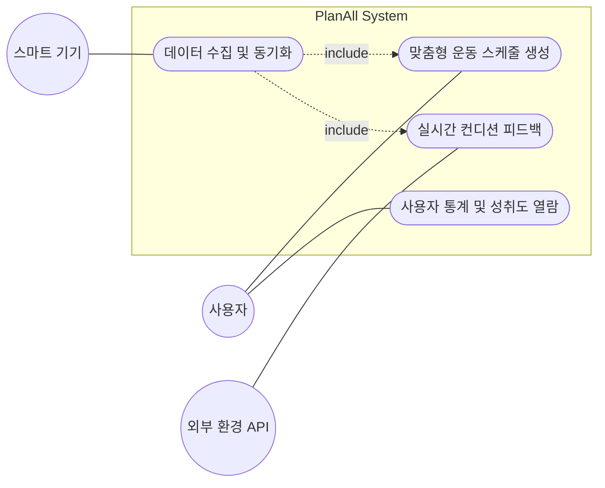

Project Title: Planwell (AI 기반 맞춤형 헬스케어 및 스케줄링 시스템)

Student No, Name, E-mail: [22212076], [정문기], [mungi00000@gmail.com]

**Project Link**: https://github.com/mungi0901/planwell

## [ Revision history ]

| Revision date | Version # | Description | Author |
| :--- | :--- | :--- | :--- |
| 2026/04/28 | 1.0.0 | First Analysis Documentation | [정문기] |
| 2026/05/08 | 1.0.1 | Use case description 및 Domain analysis 추가 | [정문기] |

---

## = Contents =
1. [Introduction](#1-introduction)
2. [Use case analysis](#2-use-case-analysis)
    2.1 [Use case diagram](#21-use-case-diagram)
    2.2 [Use case description](#22-use-case-description)
3. [Domain analysis](#3-domain-analysis)
4. [User Interface prototype](#4-user-interface-prototype)
5. [Glossary](#5-glossary)
6. [References](#6-references)

---

## 1. Introduction

본 문서는 사용자의 실시간 생체 데이터와 컨디션을 분석하여 유동적인 운동 스케줄을 제공하는 차세대 헬스케어 시스템 **'Planwell'**의 분석(Analysis) 단계 문서입니다. 

Conceptualization 단계에서 정의된 요구사항들을 바탕으로, 시스템이 무엇을 해야 하는지(What to do)를 구체화하기 위해 Use Case 모델링, Domain(구조적) 모델링, 그리고 User Interface의 초기 프로토타입을 정의합니다. 이를 통해 향후 설계(Design) 및 구현(Implementation) 단계의 명확한 기준을 제시합니다.

---

## 2. Use case analysis

### 2.1 Use case diagram


### 2.2 Use case description

#### **Use case 1: 맞춤형 운동 스케줄 생성**
| 항목 | 내용 |
| :--- | :--- |
| **Actor** | 주 액터: 사용자 (Customer) / 부 액터: 스마트 기기 (Smart Device) |
| **Summary** | 사용자의 생체 데이터 및 선호도를 분석하여 당일 최적화된 운동 루틴을 생성한다. |
| **Precondition (사전조건)** | 사용자가 시스템에 로그인되어 있어야 하며, 초기 신체 정보 및 선호/기피 운동이 설정되어 있어야 한다. |
| **Postcondition (사후조건)** | 사용자에게 당일 수행할 운동 종목, 세트 수, 무게가 포함된 스케줄이 화면에 출력되고 DB에 저장된다. |

**[ Scenario ]**
* **Main success scenario (정상 흐름)**
  1. 사용자가 앱을 실행하고 '오늘의 루틴 생성' 버튼을 누른다.
  2. 시스템은 스마트 기기로부터 전날의 수면 데이터와 당일 심박수 데이터를 요청하여 수신한다.
  3. 시스템은 머신러닝 알고리즘을 통해 사용자의 피로도와 선호 운동을 분석한다.
  4. 시스템은 분석 결과를 바탕으로 최적의 운동 루틴(종목, 세트, 무게)을 생성한다.
  5. 시스템은 생성된 루틴을 화면에 표시한다.
* **Extension scenario (대안 흐름)**
  * 2a. 스마트 기기 연결이 끊겨 데이터를 수신할 수 없는 경우:
    * 시스템은 "기기 연결을 확인해주세요. 기본 루틴으로 대체하시겠습니까?"라는 팝업을 표시한다.
    * 사용자가 수락하면 기존 수행 데이터를 바탕으로 한 기본 루틴을 생성하여 표시한다(흐름 5로 이동).

#### **Use case 2: 실시간 컨디션 피드백 (대체 운동 추천)**
| 항목 | 내용 |
| :--- | :--- |
| **Actor** | 주 액터: 사용자 (Customer) / 부 액터: 외부 환경 API (Weather API) |
| **Summary** | 사용자의 피로도나 외부 날씨 악화 시, 부상 방지를 위해 대체 운동이나 휴식(마사지 등)을 제안한다. |
| **Precondition (사전조건)** | 당일의 운동 스케줄이 생성되어 있어야 한다. |
| **Postcondition (사후조건)** | 운동 스케줄이 실내 운동이나 스트레칭 위주의 루틴으로 변경 업데이트된다. |

**[ Scenario ]**
* **Main success scenario (정상 흐름)**
  1. 사용자가 야외 러닝이 포함된 루틴을 확인한다.
  2. 시스템이 Weather API를 호출하여 현재 위치의 날씨(비/미세먼지)를 확인한다.
  3. 날씨가 악화된 것을 감지한 시스템이 실내 운동(예: 실내 사이클, 줄넘기)으로 루틴을 즉시 변경한다.
  4. 시스템은 사용자에게 "날씨 악화로 인해 실내 대체 운동으로 스케줄이 변경되었습니다"라는 알림을 전송한다.
  5. 사용자가 변경된 루틴을 확인하고 운동을 시작한다.

3. Domain Analysis
```
classDiagram
    class Customer {
        -String userID
        -String name
        -Float weight
        -Float height
        +login()
        +viewRoutine()
        +recordProgress()
    }

    class HealthData {
        -Date syncDate
        -Int sleepDuration
        -Int heartRate
        -String conditionStatus
        +fetchFromWatch()
        +analyzeCondition()
    }

    class WorkoutSchedule {
        -Date scheduleDate
        -String targetMuscle
        -Boolean isCompleted
        +generateRoutine()
        +modifySchedule()
    }

    class Exercise {
        -String exerciseName
        -Int recommendedSets
        -Float recommendedWeight
        +getDetail()
    }

    class AI_Engine {
        -String modelVersion
        +predictBestRoutine()
        +updateUserLevel()
    }

    %% Relationships
    Customer "1" --> "1..*" HealthData : generates >
    Customer "1" --> "1..*" WorkoutSchedule : owns >
    HealthData "*" --> "1" AI_Engine : feeds >
    WorkoutSchedule "1" *-- "1..*" Exercise : contains >
    AI_Engine "1" --> "*" WorkoutSchedule : creates >
```
## 4. User Interface prototype

| Screen Name | Wireframe / Description | Key Features |
| :--- | :--- | :--- |
| **Main Dashboard** | 상단: 프로필 및 현재 날씨/컨디션 요약<br>중앙: [오늘의 추천 루틴 생성] 메인 버튼<br>하단: 주간 출석률 그래프 요약 | 사용자가 앱 실행 시 가장 먼저 마주하는 화면. 직관적으로 오늘의 목표를 확인하고 루틴을 생성할 수 있음. |
| **Routine Detail** | 상단: 타겟 부위 (예: 하체, 어깨)<br>리스트: 스쿼트 4Set x 100kg<br>하단: [운동 시작] 버튼 | AI가 생성한 루틴을 리스트업하여 보여주며, 각 항목 터치 시 대체 운동으로 변경할 수 있는 스와이프 기능 제공. |
| **Condition Alert** | 화면 중앙 모달 팝업:<br>"수면시간이 부족합니다. (4h 30m)<br>부상 방지를 위해 중량을 10% 낮춘 루틴으로 변경합니다." | 생체 데이터 분석 후, 무리한 운동이 감지될 때 띄워지는 실시간 피드백 경고창. |
| **Stats & Progress** | 캘린더 뷰 (운동한 날짜 마킹)<br>AI 변화 과정: 눈바디 사진 타임랩스<br>하단: 누적 볼륨량 차트 | 사용자의 장기적인 동기부여를 위한 시각화 페이지. 사진 업로드 및 성취도 확인 가능. |

---

## 5. Glossary

* **Domain Analysis (도메인 분석)**: 해결하고자 하는 문제 영역에 존재하는 사물, 개념, 사람 등을 식별하고 이들 간의 구조적 관계를 파악하는 과정.
* **Use case (유스케이스)**: 시스템이 사용자를 위해 수행하는 가치 있는 결과의 집합으로, 시스템의 기능적 요구사항을 나타냄.
* **Precondition (사전조건)**: 해당 유스케이스가 정상적으로 실행되기 위해 시스템이 미리 갖추고 있어야 하는 상태.
* **HealthData (생체 데이터)**: 스마트 기기로부터 동기화되는 사용자의 수면량, 심박수, 스트레스 지수 등의 1차 데이터.

---

## 6. References

* **Apple HealthKit Developer Documentation**: 스마트 기기 생체 데이터 연동 로직 분석 참고.
* **Google Fit REST API Reference**: 멀티 플랫폼 데이터 수집 아키텍처 참고.
