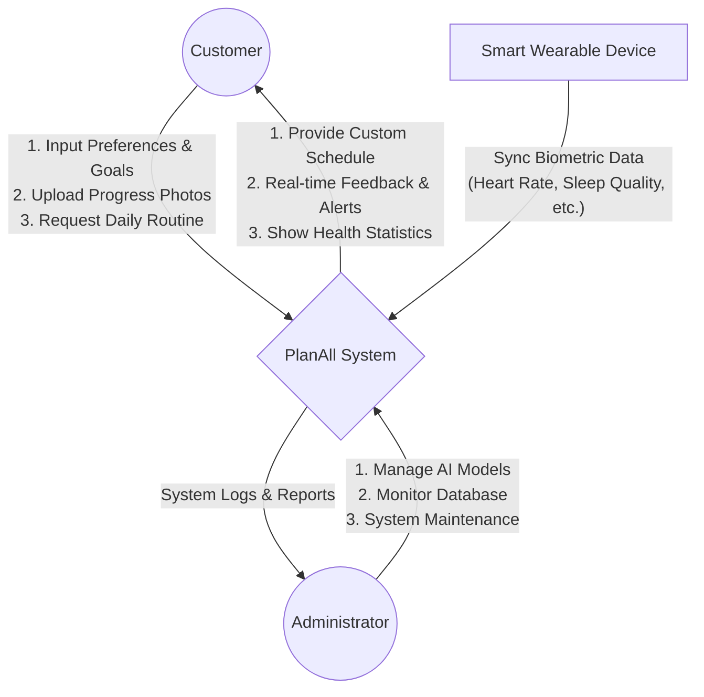
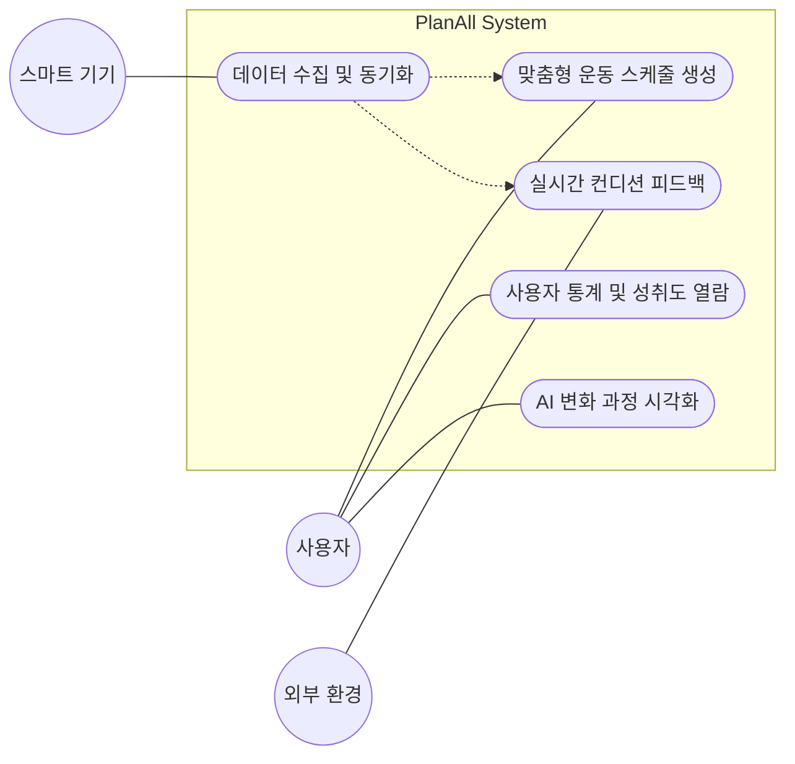

# 1. Conceptualization

**Project Title**: PlanAll (AI 기반 맞춤형 헬스케어 및 스케줄링 시스템)
**Student No, Name, E-mail**: [22212076], [정문기], [mungi000000@gmail.com]

## [ Revision history ]

| Revision date | Version # | Description | Author |
| :--- | :--- | :--- | :--- |
| 2026/03/27 | 1.0.0 | First Documentation - 전체 구조 및 초기 기획안 작성 | [정문기] |

---

## = Contents =
1. [Business purpose](#1-business-purpose)
2. [System context diagram](#2-system-context-diagram)
3. [Use case list](#3-use-case-list)
4. [Concept of operation](#4-concept-of-operation)
5. [Problem statement](#5-problem-statement)
6. [Glossary](#6-glossary)
7. [References](#7-references)

---

## 1. Business purpose

### 1) Project background
현대인들의 건강 관리에 대한 관심이 높아지면서 피트니스 관련 애플리케이션 시장이 급성장하고 있습니다. 그러나 기존의 운동 앱들은 대부분 정형화된 루틴을 일방적으로 제공하는 데 그치고 있습니다. 사용자들은 각기 다른 신체 능력, 당일의 컨디션(수면 시간, 스트레스 지수 등), 그리고 개인적인 목표를 가지고 있음에도 불구하고, 이를 실시간으로 반영해 주는 서비스는 부족한 실정입니다. 
또한, 혼자서 운동을 진행할 경우 쉽게 흥미를 잃고 포기하게 되는 '동기부여 결여' 현상이 빈번하게 발생합니다. 이러한 문제를 해결하기 위해 사용자의 실시간 데이터를 기반으로 유동적인 스케줄을 제공하고, 시각적 변화 기록을 통해 지속적인 동기부여를 이끌어내는 차세대 헬스케어 시스템이 필요합니다.

### 2) Goal
* **초개인화된 스케줄 자동 생성**: 스마트 기기로부터 수집된 개인의 신체 데이터(수면량, 심박수 등)와 선호/기피 운동 데이터를 AI로 분석하여 매일 최적화된 운동 스케줄을 자동 생성합니다.
* **실시간 컨디션 피드백**: 당일의 날씨, 수면 부족 여부, 이전 운동으로 인한 근육 피로도 등을 종합하여 부상을 방지하고 운동 강도를 유동적으로 조절합니다.
* **시각적 동기부여 및 통계 제공**: 사진 기록을 통한 변화 과정(Before & After) 트래킹 및 예상 결과 시각화, 그리고 출석일 및 달성률의 수치화를 통해 사용자의 지속적인 운동 습관 형성을 돕습니다.

### 3) Target Market
* **효율적인 맞춤형 관리가 필요한 일반인**: 매일 바뀌는 컨디션과 바쁜 일상 속에서 본인에게 딱 맞는 운동 강도와 스케줄을 제공받고자 하는 사용자.
* **피트니스 입문자 (헬린이)**: 어떤 운동부터 시작해야 할지 막막하여 체계적인 가이드와 동기부여가 절실한 초보자.
* **부상 방지가 필수적인 운동 매니아**: 오버트레이닝을 방지하고 체계적인 휴식(마사지, 스트레칭 등) 관리가 필요한 숙련자.

---

## 2. System context diagram

## 3. Use case list

| Use Case | Actor | Description |
| :--- | :--- | :--- |
| **데이터 수집 및 동기화** | Smart Device, Customer | 스마트워치 및 스마트폰 앱과 연동하여 사용자의 수면량, 심박수 등의 생체 데이터를 실시간으로 수집합니다. |
| **맞춤형 운동 스케줄 생성** | Customer | 수집된 데이터와 사용자의 선호/기피 운동을 파악하여, 딥러닝 및 강화학습 기법을 통해 개인별 최적의 운동 프로그램을 생성하고 최적화합니다. |
| **실시간 컨디션 피드백** | Customer, Weather API | 당일의 컨디션이나 부상 발생 여부를 파악하여 강도를 조절하거나 대체 운동을 추천하며, 실내/외 운동 장소를 적응시킵니다. |
| **사용자 통계 및 성취도 열람** | Customer | 사용자가 수행한 운동 시간, 출석일, 통계 등을 수치화하여 제공하며, 특정 수치 도달 시 알림을 주어 동기를 부여합니다. |
| **AI 변화 과정 시각화** | Customer | 사용자의 사진을 입력받아 AI 기술로 변화될 미래 모습을 보여주며, 내 캐릭터를 성장시키는 'AI 트레이너' 기능을 제공합니다. |

## 4. Concept of operation

### 1) 데이터 수집 및 머신러닝 기반 맞춤형 추천
| 항목 | 내용 |
| :--- | :--- |
| **Purpose** | 개인의 건강 상태를 종합적으로 분석하여 사용자 맞춤형 운동 코칭 지원. |
| **Approach** | 스마트워치, 스마트폰 앱 등에서 수면량(심박수 등) 데이터를 실시간 수집 후, 머신러닝(딥러닝 및 강화학습) 기법을 활용하여 개인별 최적의 운동 프로그램을 추천합니다. |
| **Dynamics** | 사용자의 선호 운동과 기피 운동을 파악하거나 헬스장에서 보유하고 있는 장비를 기반으로 루틴을 자동 생성할 때 작동합니다. |
| **Goals** | 운동 수행 데이터를 학습하여 점진적으로 최적화된 운동 루틴을 제공합니다. |

### 2) 실시간 컨디션 반영 및 피드백 시스템
| 항목 | 내용 |
| :--- | :--- |
| **Purpose** | 부상이 발생한 경우 해당 부위를 고려한 대체 운동을 추천하고 무리한 운동 방지를 통해 부상 위험을 감소시킵니다. |
| **Approach** | 오늘 날씨를 반영하여 실내/실외 운동을 추천하고, 오늘 운동한 부분 기준으로 마사지, 스트레칭, 수분 섭취 알림을 제공합니다. |
| **Dynamics** | 수면부족 시 강도를 낮추거나, 충분한 에너지가 있을 때 등 사용자의 신체 변화와 컨디션을 실시간으로 반영하여 강도를 조절합니다. |
| **Goals** | 정형화된 운동 프로그램이 아닌, 사용자의 컨디션에 따라 실시간으로 조정되는 운동 루틴을 제공하여 운동 효율성을 극대화합니다. |

### 3) 통계 열람 및 AI 동기부여 시스템
| 항목 | 내용 |
| :--- | :--- |
| **Purpose** | 사용자가 목적(예: n 개월만에 몸짱 되기)을 달성할 수 있도록 동기부여 및 지속성을 강화합니다. |
| **Approach** | 통계량이 특정 수치에 도달했을 때(예: 스쿼트 100세트 수행) 알림을 제공하고, 사진을 통해 AI 이미지 생성으로 미래의 변화될 모습을 보여줍니다. |
| **Dynamics** | 일주일 간격으로 기록(사진 등)을 입력받거나 다양한 운동 데이터(운동 시간, 출석일 등)를 조회할 때 적용됩니다. |
| **Goals** | 운동을 통해 내 캐릭터를 성장시키는 '함께 성장하는 AI 트레이너'를 통해 지속 가능한 건강 관리를 가능하게 합니다. |

## 5. Problem statement

* **Problem #1: 스마트 기기 연동 및 데이터 수집 (Data Collection)**
  * 스마트워치와의 연동을 통해 수면량, 심박수 등의 사용자 데이터를 실시간으로 수집하고, 컨디션에 따른 운동량을 정확하게 산출하는 시스템 연동 기술이 요구됩니다.
* **Problem #2: 헬스케어 데이터 통합 및 다차원 분석 (Data Analysis)**
  * 다양한 스마트 기기와 연동하여 수면, 스트레스 지수 등을 종합적으로 분석하고 반영해야 합니다. 운동뿐만 아니라 전반적인 건강 루틴을 통합하는 다차원 분석 알고리즘 설계가 필요합니다.
* **Problem #3: AI 기반의 지속적 학습 및 최적화 (AI Optimization)**
  * 기존 운동 앱의 정적인 계획과 달리, 머신러닝(딥러닝 및 강화학습)을 통해 개인의 운동 패턴과 성취도를 학습하고 점진적으로 운동 강도를 조절할 수 있는 최적화 모델 구축이 필요합니다.

## 6. Glossary

**PlanAll**: 개인의 신체 데이터와 운동 선호도를 분석해 최적의 운동 스케줄을 자동 생성하는 AI 기반 맞춤형 코칭 시스템입니다.
**AI 트레이너**: 사용자의 사진을 받아 AI 이미지 생성을 통해 바뀔 미래의 모습을 보여주며 함께 성장하는 시스템 요소입니다.
**스마트 기기 연동**: 스마트워치나 스마트폰 앱을 통해 사용자의 심박수, 수면량 등의 일상 상태 데이터를 실시간으로 수집하는 기능입니다.
**실시간 피드백**: 사용자의 컨디션, 날씨, 기구 유무 등을 감지하여 실시간으로 대체 운동 추천이나 마사지/수분 섭취 알림을 제공하는 기능입니다.

## 7. References

* **Apple HealthKit Developer Documentation**: 스마트 기기 생체 데이터(심박수, 수면량 등) 연동 및 수집 아키텍처 참고.
* **Google Fit REST API Reference**: 멀티 플랫폼 기반 헬스케어 데이터 수집 및 연동 구조 참고.
* **OpenWeatherMap API Documentation**: 실시간 날씨 데이터 기반 실내외 환경 적응형 운동 추천 로직 설계 참고.
* **TensorFlow/Keras Documentation**: 딥러닝 및 머신러닝 기반 사용자 맞춤형 추천 알고리즘 설계 참고.
