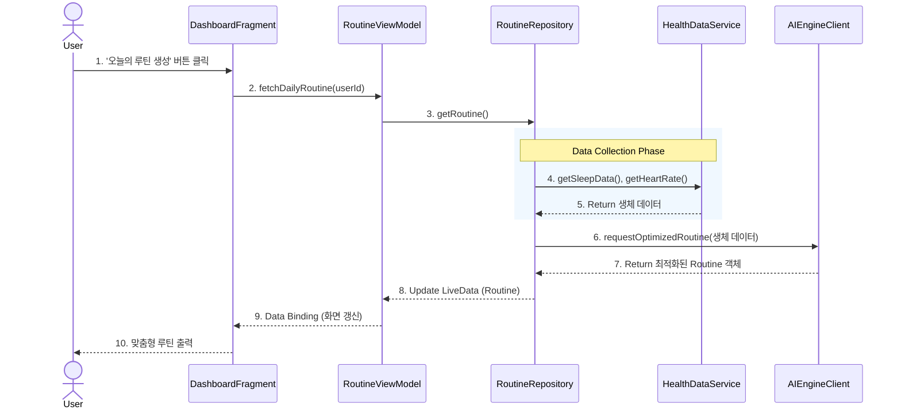
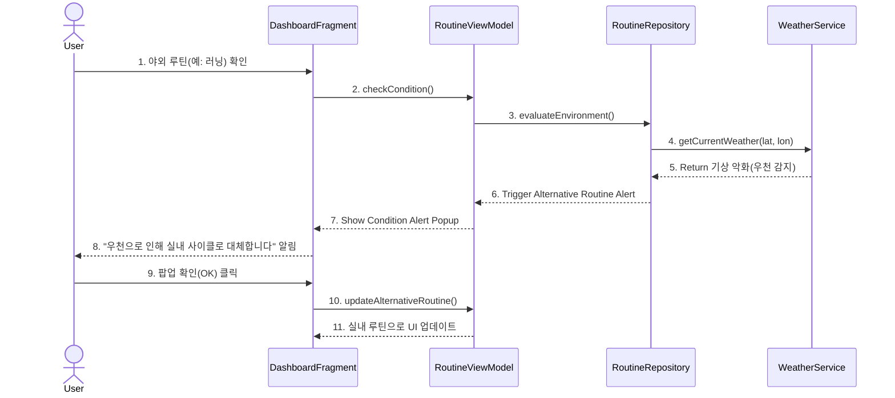
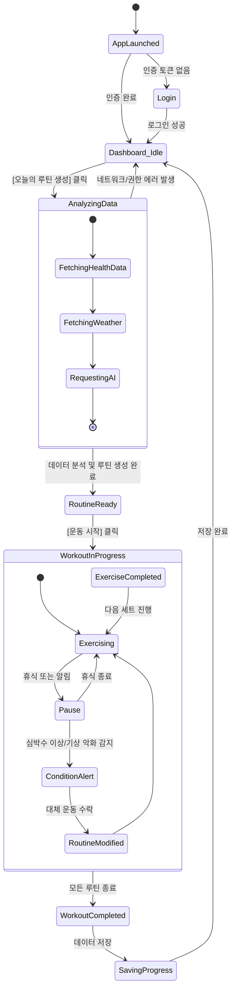

Design 

**Project Title**: Planwell (AI 기반 맞춤형 헬스케어 및 스케줄링 시스템)

**Student No, Name, E-mail**: 22212076, 정문기, mungi00000@gmail.com

**Project Link**: https://github.com/mungi0901/planwell

## [ Revision history ]

| Revision date | Version # | Description | Author |
| :--- | :--- | :--- | :--- |
| 2026/05/20 | 1.0.0 | First Design Documentation | 정문기 |
| 2026/06/05 | 1.1.0 | Finished Design Documentation | 정문기 |

---

## = Contents =
1. [Introduction](#1-introduction)
2. [Class diagram](#2-class-diagram)
3. [Sequence diagram](#3-sequence-diagram)
4. [State machine diagram](#4-state-machine-diagram)
5. [Implementation requirements](#5-implementation-requirements)
6. [Glossary](#6-glossary)
7. [References](#7-references)

---

## 1. Introduction

본 문서는 Planwell (AI 기반 맞춤형 헬스케어 및 스케줄링 시스템)의 세 번째 개발 단계인 Design(설계) 문서입니다. 앞선 Analysis(분석) 단계에서 도출된 요구사항과 도메인 모델을 바탕으로, 실제 시스템이 '어떻게(How)' 구현될 것인지를 구체적인 소프트웨어 아키텍처 수준에서 정의합니다.

Planwell은 모바일 애플리케이션(Android/iOS) 환경에서 동작하며, 유지보수와 확장이 용이한 **MVVM(Model-View-ViewModel) 아키텍처 패턴**을 채택하였습니다. 본 문서에서는 시스템을 구성하는 핵심 클래스들의 관계와 내부 구조(Class Diagram), 주요 유스케이스가 실행될 때 객체 간의 동적 상호작용(Sequence Diagram), 그리고 사용자의 앱 이용 흐름에 따른 상태 변화(State Machine Diagram)를 명세합니다. 이 문서는 향후 진행될 실제 코드 구현(Implementation)의 직접적인 설계도가 됩니다.

---

## 2. Class diagram

시스템의 정적 구조를 나타내는 클래스 다이어그램입니다. MVVM 패턴을 기반으로 UI 층(View), 상태 관리 층(ViewModel), 비즈니스 로직 및 데이터 접근 층(Repository/Service)으로 분리하여 설계하였습니다.

### 주요 클래스 설명
* **DashboardFragment**: 메인 화면의 UI를 담당합니다. ViewModel의 데이터를 관찰(Observe)하여 화면을 갱신하고 사용자의 이벤트를 전달합니다.
* **RoutineViewModel**: 뷰와 모델 사이의 매개체로, UI 관련 데이터를 보관하고 생명주기를 관리합니다.
* **RoutineRepository**: 데이터의 출처(로컬 DB, 외부 API, AI 서버)를 추상화하여 비즈니스 로직에 필요한 데이터를 정제하여 제공합니다.
* **HealthDataService**: 기기에 내장된 Google Health Connect API 등에 접근하여 수면 시간, 심박수 등의 생체 데이터를 수집합니다.
* **WeatherService**: OpenWeatherMap API 등을 호출하여 현재 위치의 기상 악화(우천, 미세먼지 등) 여부를 판단합니다.
* **AIEngineClient**: 수집된 생체 데이터를 기반으로 외부 AI 서버와 통신하여 최적화된 운동 루틴을 응답받는 역할을 수행합니다.

---

## 3. Sequence diagram

객체 간의 메시지 흐름을 시간 순서대로 보여주는 시퀀스 다이어그램입니다. Planwell의 핵심 기능 두 가지를 정의합니다.

### 3.1 맞춤형 운동 스케줄 생성 (Daily Routine Generation)
사용자가 앱을 켜고 오늘의 맞춤형 루틴을 생성하는 과정입니다.

### 3.2 실시간 컨디션 피드백 및 대체 운동 추천
날씨 악화 시, 야외 운동이 포함된 루틴을 실내 운동으로 대체하는 과정입니다.

---

## 4. State machine diagram

사용자가 앱을 실행한 후 운동을 완료하기까지, 시스템 관점에서의 라이프사이클과 상태 변화(State Transition)를 나타냅니다.

### 상태(State) 설명
* **Dashboard_Idle**: 사용자가 앱을 켜고 대기하는 기본 상태.
* **AnalyzingData**: 스마트 기기의 데이터와 날씨를 수집하고 AI를 호출하는 상태. (내부적으로 데이터 페치 및 모델 요청 상태를 가짐)
* **ConditionAlert**: 운동 진행 중(WorkoutInProgress) 실시간 피드백이 발생하여 경고를 띄우고 시스템이 대기하는 인터럽트 상태.

---

## 5. Implementation requirements

Planwell 시스템의 실제 구현을 위한 하드웨어 및 소프트웨어 요구사항입니다.

### 5.1 H/W Platform Requirements
* **Mobile Device**: RAM 4GB 이상, 저장공간 2GB 이상 여유가 있는 안드로이드/iOS 스마트폰.
* **Wearable Device**: 심박수 및 수면 추적 센서가 내장된 스마트워치 (Wear OS 3.0 이상 기반 Galaxy Watch 또는 Apple Watch 6세대 이상 권장).

### 5.2 S/W Platform Requirements
* **Client App**: Android SDK API 26 (Android 8.0) 이상 지원.
* **Implementation Language**: Kotlin (Android 앱 개발), Python (AI/ML 서버 개발), Java/Spring Boot (백엔드 API).
* **Open APIs**: 
  * Google Health Connect (생체 데이터 연동)
  * OpenWeatherMap API (위치 기반 기상 데이터)
* **Architecture Pattern**: MVVM (Model-View-ViewModel) + Repository Pattern.

---

## 6. Glossary

* **MVVM (Model-View-ViewModel)**: UI 로직(View)과 비즈니스 로직(Model)을 분리하고, ViewModel이 그 사이를 중재하여 코드의 재사용성과 유지보수성을 높이는 소프트웨어 아키텍처 패턴.
* **Sequence Diagram**: 시스템의 동적 모델을 표현하며, 객체들이 어떠한 순서로 서로 메시지를 주고받는지를 시간의 흐름에 따라 나타낸 다이어그램.
* **State Machine Diagram**: 단일 객체나 시스템 전체가 라이프사이클 동안 거칠 수 있는 상태(State)들과, 특정 이벤트에 의해 상태가 전이(Transition)되는 과정을 시각화한 다이어그램.
* **Data Binding (데이터 바인딩)**: ViewModel의 데이터가 변경될 때 View(화면)가 즉각적으로 동기화되어 업데이트되도록 연결하는 기술.

---

## 7. References

* **Google Health Connect Documentation**: Android 통합 건강 데이터 연동 및 권한 설정 아키텍처 참고. https://developer.android.com/health-and-fitness/health-connect
* **Android Architecture Components**: MVVM 패턴, LiveData, Repository 패턴 설계 가이드라인. https://developer.android.com/jetpack/guide
