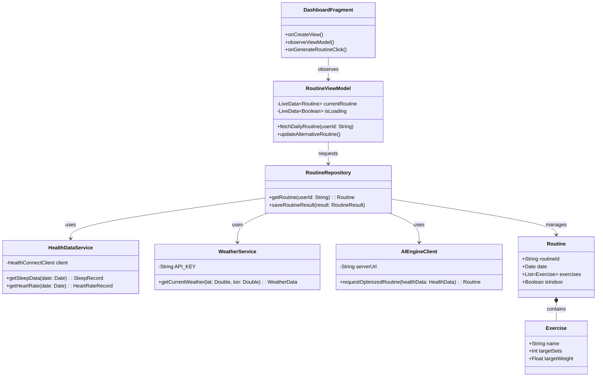
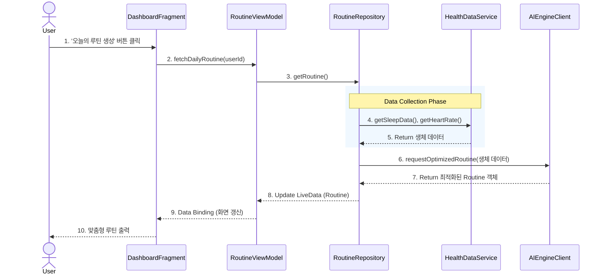
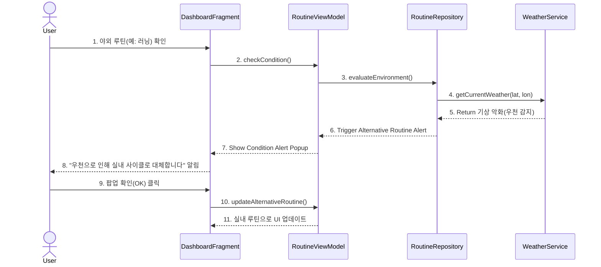
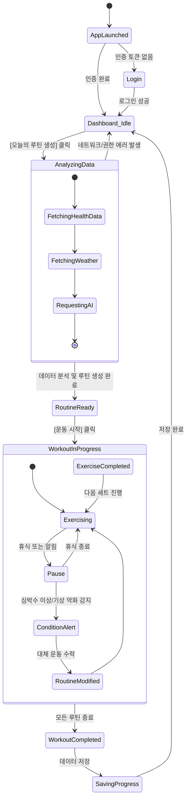

**Design** 

**Project Title**: Planwell (AI 기반 맞춤형 헬스케어 및 스케줄링 시스템)

**Student No, Name, E-mail**: 22212076, 정문기, mungi00000@gmail.com

**Project Link**: https://github.com/mungi0901/planwell

## [ Revision history ]

| Revision date | Version # | Description | Author |
| :--- | :--- | :--- | :--- |
| 2026/05/20 | 1.0.0 | First Design Documentation | 정문기 |
| 2026/06/05 | 1.1.0 | Finished Design Documentation | 정문기 |
| 2026/06/05 | 1.1.1 | Add Introduction and other document details | 정문기 |
---

## = Contents =
1. [Introduction](#1-introduction)
2. [Class diagram](#2-class-diagram)
3. [Sequence diagram](#3-sequence-diagram)
4. [State machine diagram](#4-state-machine-diagram)
5. [Implementation requirements](#5-implementation-requirements)
6. [Glossary](#6-glossary)
7. [References](#7-references)

---

## 1. Introduction

현대인들은 체력 증진과 다이어트를 위해 헬스케어 앱을 많이 이용하지만, 대부분의 앱은 사용자의 당일 컨디션이나 외부 환경을 고려하지 않은 채 정형화된 운동 루틴만을 제공합니다. 예를 들어, 전날 야근으로 수면이 부족하거나 당일 비가 오는 상황임에도 무리한 야외 러닝이나 고중량 웨이트를 요구하여 오히려 부상 위험을 높이고 흥미를 잃게 만드는 경우가 많습니다. "Planwell"은 이러한 기존 시스템의 한계를 극복하기 위해, 스마트 기기로부터 수집한 사용자의 실시간 생체 데이터(수면, 심박수 등)와 외부 API(날씨 등)를 종합적으로 분석하여 매일 유동적이고 최적화된 맞춤형 운동 스케줄을 제공하는 차세대 헬스케어 시스템입니다.

본 문서는 Planwell (AI 기반 맞춤형 헬스케어 및 스케줄링 시스템)의 세 번째 개발 단계인 Design(설계) 문서입니다. 앞선 Analysis(분석) 단계에서 도출된 요구사항과 도메인 모델을 바탕으로, 실제 시스템이 '어떻게(How)' 구현될 것인지를 구체적인 소프트웨어 아키텍처 수준에서 정의합니다.

Planwell은 모바일 애플리케이션(Android/iOS) 환경에서 동작하며, 유지보수와 확장이 용이한 **MVVM(Model-View-ViewModel) 아키텍처 패턴**을 채택하였습니다. 본 문서에서는 시스템을 구성하는 핵심 클래스들의 관계와 내부 구조(Class Diagram), 주요 유스케이스가 실행될 때 객체 간의 동적 상호작용(Sequence Diagram), 그리고 사용자의 앱 이용 흐름에 따른 상태 변화(State Machine Diagram)를 명세합니다. 이 문서는 향후 진행될 실제 코드 구현(Implementation)의 직접적인 설계도가 됩니다.

---

## 2. Class diagram

시스템의 정적 구조를 나타내는 클래스 다이어그램입니다. MVVM 패턴을 기반으로 UI 층(View), 상태 관리 층(ViewModel), 비즈니스 로직 및 데이터 접근 층(Repository/Service)으로 분리하여 설계하였습니다.

### 주요 클래스 설명
* **DashboardFragment (View)**: 사용자가 직접 상호작용하는 화면(UI)을 의미합니다. 사용자의 입력을 받아 ViewModel에 전달하고, ViewModel의 상태 변화를 관찰(`observeViewModel`)하여 화면에 추천 루틴을 렌더링합니다.
* **RoutineViewModel (ViewModel)**: View와 Model 사이의 중재자 역할을 합니다. 앱의 회전이나 일시 정지 상태에서도 데이터(`currentRoutine`)를 안전하게 유지하며, View가 데이터의 출처를 모르게 캡슐화합니다.
* **RoutineRepository (Repository)**: 데이터를 어디서 가져올지 결정하는 관리자입니다. 내부 DB를 사용할지, 외부 API를 호출할지 추상화하여 비즈니스 로직에 정제된 데이터를 반환합니다.
* **HealthDataService / WeatherService**: 외부 데이터 소스와 통신하는 서비스 클래스입니다. 기기에 내장된 건강 API를 호출해 수면/심박수 데이터를 수집하거나, 외부 기상청 API를 호출해 날씨 정보를 수집합니다.
* **AIEngineClient**: 수집된 데이터를 바탕으로 AI 서버에 분석을 요청하고, 그 결과로 생성된 최적화 루틴을 반환받는 네트워크 클라이언트 객체입니다.

---

## 3. Sequence diagram

객체 간의 메시지 흐름을 시간 순서대로 보여주는 시퀀스 다이어그램입니다. Planwell의 핵심 기능 두 가지를 정의합니다.

### 3.1 맞춤형 운동 스케줄 생성 (Daily Routine Generation)
사용자가 앱을 켜고 오늘의 맞춤형 루틴을 생성하는 과정입니다.

**[흐름 설명]**
사용자가 메인 화면에서 '오늘의 루틴 생성' 버튼을 클릭하면, View는 이벤트를 감지하고 `RoutineViewModel`에 루틴 갱신 메서드를 호출합니다. ViewModel은 다시 `RoutineRepository`에 데이터를 요청합니다. 
Repository는 단일 데이터베이스를 조회하는 것에 그치지 않고, 먼저 `HealthDataService`를 호출하여 사용자의 전날 수면 시간과 현재 심박수 데이터를 수집합니다. 데이터를 확보한 Repository는 이를 `AIEngineClient`를 통해 분석 서버로 전송합니다. AI 서버가 사용자의 피로도와 성장 수치를 계산하여 최적의 `Routine` 객체를 반환하면, ViewModel의 LiveData가 업데이트됩니다. 데이터 바인딩 구조에 의해 View는 즉시 변경된 루틴을 화면에 출력하여 사용자에게 제공합니다.

### 3.2 실시간 컨디션 피드백 및 대체 운동 추천
날씨 악화 시, 야외 운동이 포함된 루틴을 실내 운동으로 대체하는 과정입니다.

**[흐름 설명]**
당일 예정된 운동이 '야외 러닝' 등 외부 환경의 영향을 받는 종목일 경우, 시스템은 주기적으로 `WeatherService`를 호출하여 실시간 날씨 데이터를 가져옵니다. 비가 오거나 미세먼지 수치가 기준치 이상으로 악화된 것을 시스템이 감지하면, Repository는 ViewModel에 경고 이벤트를 트리거합니다. ViewModel은 View에 팝업창을 띄워 사용자에게 현재 상황과 부상 위험을 알리며 실내 대체 운동을 제안합니다. 사용자가 이를 수락하면 `updateAlternativeRoutine()` 로직이 실행되어, 즉시 야외 운동이 실내 사이클이나 홈트레이닝 등으로 변경되고 화면이 갱신됩니다.

---

## 4. State machine diagram

사용자가 앱을 실행한 후 운동을 완료하기까지, 시스템 관점에서의 라이프사이클과 상태 변화(State Transition)를 나타냅니다.

**[상태 설명]**
애플리케이션을 최초로 실행하면 `AppLaunched` 상태를 거쳐 사용자 인증 여부에 따라 `Login` 또는 메인 화면인 `Dashboard_Idle` 상태로 진입합니다. 
사용자가 스케줄 생성을 요청하면 시스템은 `AnalyzingData`라는 복합 상태로 진입하게 되며, 이 내부에서는 기기 데이터 동기화, 날씨 조회, AI 서버 통신이 순차적으로 일어납니다. 
데이터 분석이 무사히 끝나면 `RoutineReady` 상태가 되어 사용자의 시작을 대기합니다. 운동이 시작되면 `WorkoutInProgress` 상태가 되며, 세트 진행과 휴식을 반복(`Exercising` <-> `Pause`)합니다. 만약 운동 중 심박수 급증이나 날씨 악화가 감지되면 인터럽트가 발생하여 `ConditionAlert` 상태로 빠지며 루틴을 수정한 후 다시 복귀합니다. 모든 스케줄이 완료되면 `SavingProgress` 상태에서 서버에 기록을 저장하고 다시 대기 상태로 돌아갑니다.

---

## 5. Implementation requirements

본 Planwell 시스템을 실제 환경에서 구현하고 동작시키기 위한 필수 하드웨어 및 소프트웨어 요구사항입니다.

### 5.1 H/W Platform Requirements
* **Client Device**: RAM 4GB 이상, 10GB 이상의 여유 공간을 가진 스마트 기기 (스마트폰 또는 태블릿).
* **Wearable Device**: 심박수 센서, 자이로스코프, 수면 추적 기능이 내장된 스마트워치 (Wear OS 기반 Galaxy Watch 또는 Apple Watch 호환 기기).
* **Server System**: AI 연산 처리를 위한 GPU 가속 지원 클라우드 서버 인스턴스. (최소 8 Core CPU, 16GB RAM)

### 5.2 S/W Platform Requirements
* **Operating System**: Android 8.0 (Oreo, API Level 26) 이상 또는 iOS 14 이상.
* **Implementation Language**: Kotlin (안드로이드 클라이언트 개발), Python 3.9+ (AI 분석 모델 및 서버 개발), Java (스프링 부트 백엔드).
* **Open APIs**:
    * `Google Health Connect API` (기기 내 신체 데이터 통합 수집)
    * `OpenWeatherMap API` (실시간 위치 기반 기상 데이터 수집)
* **Network**: 실시간 데이터 분석 및 갱신을 위해 상시 인터넷 연결(Wi-Fi 또는 LTE/5G) 필수.

---

## 6. Glossary

* **MVVM (Model-View-ViewModel)**: UI 관련 로직(View)과 비즈니스 로직(Model)을 분리하고, 그 사이를 ViewModel이 연결해 줌으로써 코드의 재사용성과 유지보수성을 극대화하는 소프트웨어 아키텍처 패턴입니다.
* **LiveData**: 수명 주기(Lifecycle)를 인식하여, View(화면)가 활성화되어 있을 때만 데이터를 업데이트하여 메모리 누수를 방지하는 안드로이드의 관찰 가능한(Observable) 데이터 홀더 클래스입니다.
* **Sequence Diagram**: 시스템 내의 객체들이 특정 기능을 수행하기 위해 어떠한 메시지를 어떤 시간 순서로 주고받는지를 시간의 흐름에 따라 시각적으로 표현한 동적 모델링 다이어그램입니다.
* **State Machine Diagram**: 시스템 전체 또는 단일 객체가 생성부터 소멸까지의 생명주기 동안 겪게 되는 여러 '상태(State)'와, 특정 이벤트에 의해 상태가 변화하는 '전이(Transition)' 과정을 시각화한 다이어그램입니다.

---

## 7. References

* **Google Health Connect Documentation**: Android 통합 건강 데이터 연동 및 권한 설정 아키텍처 참고. https://developer.android.com/health-and-fitness/health-connect
* **Android Architecture Components**: MVVM 패턴, LiveData, Repository 패턴 설계 가이드라인. https://developer.android.com/jetpack/guide
